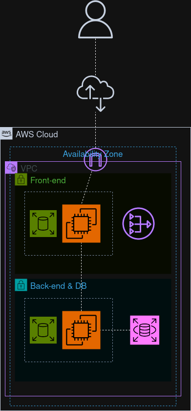
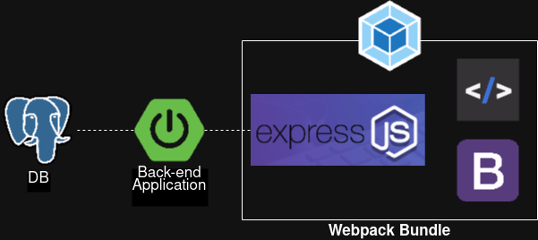

# AWSWebServer

This is a simple AWS full-stack application of a dog list.

## Architecture

The architecture for the application can be seen below:

### Connecting from the internet

The application's Virtual Private Cloud (VPC) contains an internet gateway that allows users to connect with the front-end part of the application remotely. 

### Hosting the services

To allow the application to run, machines were needed to run their services. For this, the Elastic Cloud Computing  (EC2) service was used.

### Keeping data safe

To prevent data from being erased during clean-ups, an EBS (Elastic Block System) was associated with both the back-end and the front-end of the application to run each of the services.

### Storing data

To store the data without needing to maintain the database, The Relational Database Service (RDS) was used. 

### Preventing database breaching

The user is only allowed to access the front-end part of the application, where he can interact with the database without breaching it's security. To allow stable connection from the back-end to the front-end, an Elastic IP (Static) was associated with the back-end instance.

### Maintaining the back-end

To maintain the back-end without needing to keep it in a public subnet, the bastion host architecture feature was used on a dedicated EC2 instance.

## Software used

The used software can be seen below:

### Database

The database service used in RDS was PostgreSQL, it is used to store the following dog information:

| Name | Breed | Birthdate | Atopted |
| - | - | - | - |
| Names of the dogs | Breeds of the dogs | When the dogs were born | Adopted |

### Back-end

The back-end of the application was designed in java using the SpringBoot framework using the Model Viewer Controller (MVC) design pattern.

### Front-end

The front-end was made using the Express.js framework, it allowed communication with the back-end and to create dynamic pages.

The static page was made using HTMX to make it easier to serve dynamic content without the use of complex javascript code.

The styling was made possible by the Bootstrap library (I'm bad at css, sorry).

The application was packaged using Webpack to prevent the installation of dependencies in the deploy.
